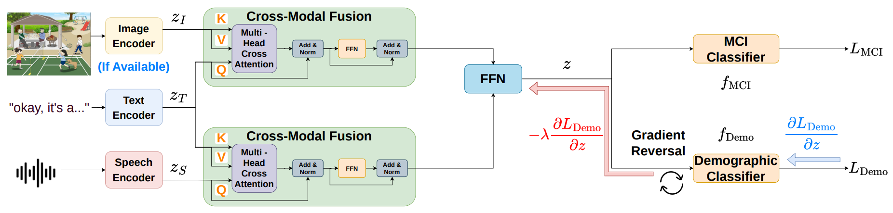

# FMD: Fair Cognitive Impairment Detection Through Unlearning

<h4 align="center">
    <a href="https://arxiv.org/abs/2606.18571">📄 Paper</a>
</h4>


## Introduction
Mild Cognitive Impairment (MCI) is a medical condition characterized by a noticeable decline in memory, language, or thinking abilities. MCI detection from spontaneous speech is promising for scalable screening. However, learned models often exploit demographic cues correlated with labels, resulting in a large performance gap across subgroups. We present a multimodal framework that combines (i) cross-model fusion between modalities (speech, text, and image), and (ii) unlearning using gradient reversal that discourages the shared embedding from encoding task-irrelevant demographic attributes. Evaluated on the multilingual benchmarks TAUKADIAL and PREPARE, our method outperforms the state-of-the-art multilingual and multimodal baseline in MCI classification while substantially reducing the performance gap across patient subgroups (sex and language). We further analyze transfer across datasets, showing that demographic unlearning helps learn more robust representations for MCI detection.



## Setup
```
git clone git@github.com:wilnn/Fair-MCI-Detection.git
cd Fair-MCI-Detection
conda create -n Fair-MCI-Detection python=3.12.11
conda activate Fair-MCI-Detection
pip install torch==2.8.0 torchvision==0.23.0 torchaudio==2.8.0 --index-url https://download.pytorch.org/whl/cu129
pip install -r requirements.txt
```
## Datasets
Please obtain the datasets from:
- [TAUKADIAL](https://talkbank.org/dementia/TAUKADIAL/index.html)
- [PREPARE](https://www.drivendata.org/competitions/253/competition-nih-alzheimers-adrd-1/)

Then, modify the paths in the `create_taukadial_dataset()` and `create_prepare_dataset()` functions in `data_preprocessing.py`. then run that file to create the CSV files: `python data_preprocessing.py`

## Train and Evaluate
- **Train and evaluate on the TAUKADIAL dataset:**
  - No GRL: `linux_run_train_no_dc_2TB.sh`
  - GRL on Sex: `linux_run_train_dc_gen_2TB.sh`
  - GRL on Language: `linux_run_train_dc_lang_2TB.sh`
- **Train and evaluate on the PREPARE dataset:**
  - No GRL: `2lb_linux_run_train_no_dc_2TB_prepare.sh`
  - GRL on Sex: `linux_run_train_dc_gen_2TB_prepare.sh`
  - GRL on Language: `linux_run_train_dc_lang_2TB_prepare.sh`
- **Train on TAUKADIAL and evaluate on PREPARE:**
  - No GRL: `2ds_linux_run_train_no_dc_2TB.sh`
  - GRL on Sex: `2ds_linux_run_train_dc_gen_2TB.sh`
  - GRL on Language: `2ds_linux_run_train_dc_lang_2TB.sh`
- **Train on PREPARE and evaluate on TAUKADIAL:**
  - No GRL: `2ds_prepare_linux_run_train_no_dc_2TB.sh`
  - GRL on Sex: `2ds_prepare_linux_run_train_dc_gen_2TB.sh`
  - GRL on Language: `2ds_prepare_linux_run_train_dc_lang_2TB.sh`
- **No cross-attention fusion (use concatenation):**
  - GRL on Sex: `linux_run_train_dc_gen_noTB.sh`
  - GRL on Language: `linux_run_train_dc_lang_noTB.sh`
